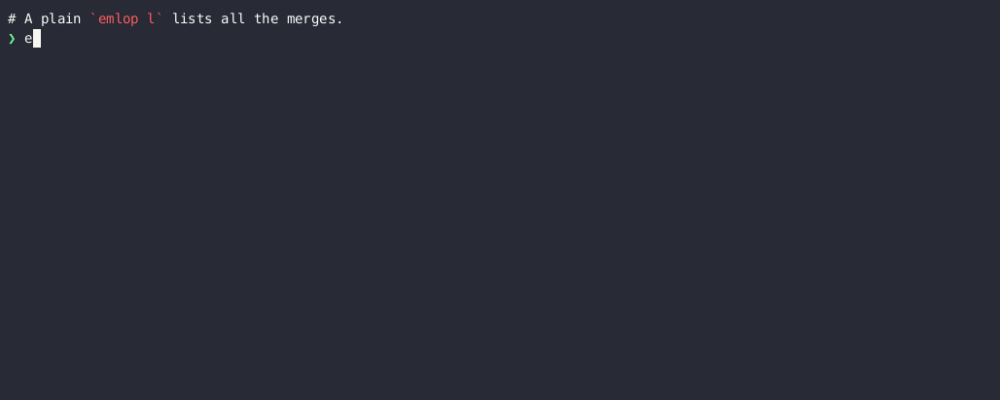
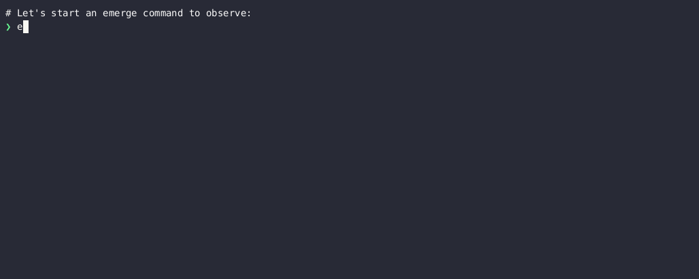
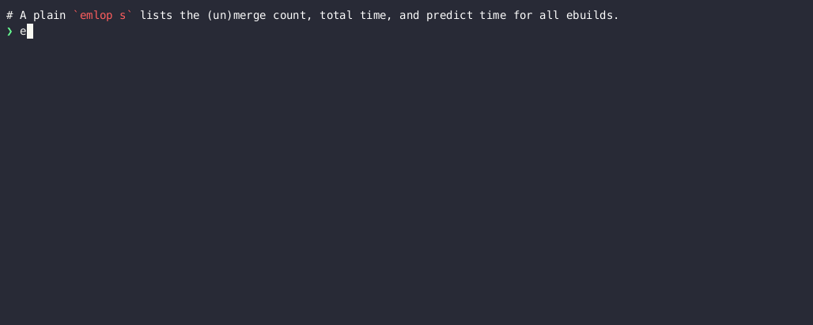

# EMerge LOg Parser

Emlop parses emerge logs (as generated by [portage](https://wiki.gentoo.org/wiki/Project:Portage),
the [Gentoo](https://www.gentoo.org/) package manager) to yield useful info like merge history and
merge time prediction.

It draws inspiration from [genlop](https://github.com/gentoo-perl/genlop) and
[qlop](https://github.com/gentoo/portage-utils) but aims to be faster, more accurate, and more
ergonomic, see [COMPARISON](COMPARISON.md).

## Usage

Emlop is split into commands. Command names and arguments can be abbreviated, and shell completion is available. See `emlop --help` and `emlop <sucommand> --help`
for complete and up to date usage info.

### Common options

All commands share these arguments, affecting parsing and output:

    OPTIONS:
      -F, --logfile <file>    Location of emerge log file. [default: /var/log/emerge.log]
      -v                      Increase verbosity (can be given multiple times).
      -h, --help              Show short (-h) or detailed (--help) help.
    FILTER:
      -f, --from <date>       Only parse log entries after <date>.
      -t, --to <date>         Only parse log entries before <date>.
    FORMAT:
      -H, --header               Show table header
          --utc                  Parse/display dates in UTC instead of local time
          --tabs                 Separate columns using tabs instead of spaces
          --duration <format>    Output durations in different formats. [default: hms]
          --date <format>        Output dates in different formats. [default: ymdhms]
          --color <when>         Enable color (auto/always/never/y/n). [default: auto]

### List merges, unmerges, and rsyncs  with `log`

Log-specific options:

    FILTER:
      <package>               Show only packages matching <package>.
      -e, --exact             Match package with a string instead of a regex.
      -s, --show <m,u,s,a>    Show (m)erges, (u)nmerges, (s)yncs, and/or (a)ll. [default: m]
      -N, --first <num>       Show only the first <num> entries.
      -n, --last <num>        Show only the last <num> entries.

### Estimate how long a merge with take with `predict`

Predict-specific arguments:

    OPTIONS:
        --tmpdir <dir>       Location of portage tmpdir. [default: /var/tmp]
        --resume <source>    Use auto, main, backup, or no portage resume list [default: auto]
    FILTER:
      -s, --show <e,m,t,a>    Show (e)emerge processes, (m)erges, (t)otal, and/or (a)ll. [default:
                            emt]
      -N, --first <num>       Show only the first <num> entries.
      -n, --last <num>        Show only the last <num> entries.
    STATS:
        --limit <num>    Use the last <num> merge times to predict durations. [default: 10]
        --avg <fn>       Select function used to predict durations. [default: median]

### Show aggregated statistics with `stats`

Stats-specific arguments:

    FILTER:
      <package>               Show only packages matching <package>.
      -e, --exact             Match package with a string instead of a regex.
      -s, --show <p,t,s,a>    Show (p)ackages, (t)otals, (s)yncs, and/or (a)ll. [default: p]
    STATS:
      -g, --groupby <y,m,w,d>    Group by (y)ear, (m)onth, (w)eek, or (d)ay.
          --limit <num>          Use the last <num> merge times to predict durations. [default: 10]
          --avg <fn>             Select function used to predict durations. [default: median]

### Other commands

* `complete` generates shell completions
* `accuracy` helps analizing predictions accuracy

## Installation

### Using portage

Enable the [GURU](https://wiki.gentoo.org/wiki/Project:GURU) or
[moltonel](https://github.com/vincentdephily/moltonel-ebuilds) overlay (install
[eselect-repository](https://wiki.gentoo.org/wiki/Eselect/Repository) and run `eselect repository
enable GURU`), then run `emerge emlop` as ususal. Work is underway for availablility in the main
portage tree.

### Using cargo

Install Rust and using [portage](https://wiki.gentoo.org/wiki/Rust) or
[rustup](https://www.rust-lang.org/en-US/install.html). Make sure `~/.cargo/bin/`, is in your
`$PATH`.

#### From crates.io

    cargo install -f emlop

#### From git

    git clone https://github.com/vincentdephily/emlop
    cd emlop
    cargo test
    cargo install -f --path .

#### Shell completion

    emlop complete bash > /usr/share/bash-completion/completions/emlop
    emlop complete zsh > /usr/share/zsh/site-functions/_emlop
    emlop complete fish > /usr/share/fish/vendor_completions.d/emlop.fish

## Contributing

Thanks in advance. See [CONTRIBUTING](CONTRIBUTING.md) for pointers. Emlop is licensed as GPLv3.
