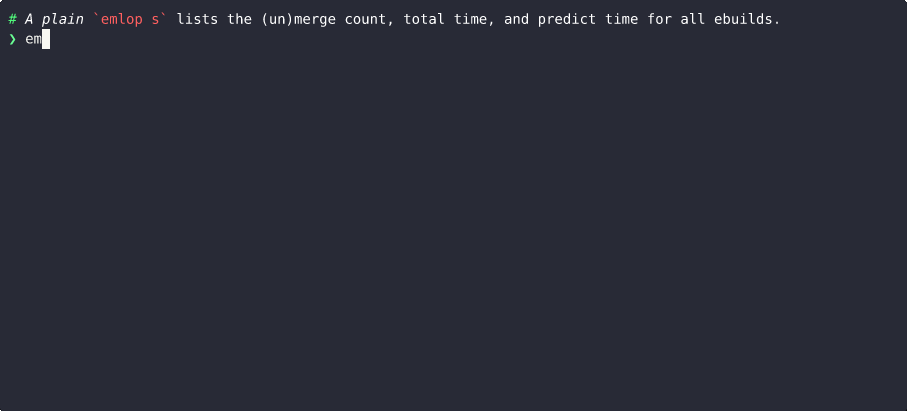

# EMerge LOg Parser

Emlop parses emerge logs (as generated by [portage](https://wiki.gentoo.org/wiki/Project:Portage),
the [Gentoo](https://www.gentoo.org/) package manager) to yield useful info like merge history and
merge time prediction.

It draws inspiration from [genlop](https://github.com/gentoo-perl/genlop) and
[qlop](https://github.com/gentoo/portage-utils) but aims to be faster, more accurate, and more
ergonomic, see [comparison](docs/COMPARISON.md).

## Usage

Emlop is split into commands, which share a lot of common options:

    Commands:
      log       Show log of sucessful merges, unmerges and syncs
      predict   Predict merge times for current or pretended merges
      stats     Show statistics about syncs, per-package (un)merges, and total (un)merges
      accuracy  Compare actual merge time against predicted merge time
      complete  Shell completion helper
    Options:
      -F, --logfile <file>  Location of emerge log file
      -v...                 Increase verbosity (can be given multiple times)
      -h, --help            Print help (see more with '--help')
      -V, --version         Print version
    Filter:
      -f, --from <date>  Only parse log entries after <date/command>
      -t, --to <date>    Only parse log entries before <date/command>
    Format:
      -H, --header [<bool>]    Show table header
          --duration <format>  Output durations in different formats
          --date <format>      Output dates in different formats
          --utc [<bool>]       Parse/display dates in UTC instead of local time
          --color [<bool>]     Enable color (yes/no/auto)
          --theme <key:SGR>    Set terminal colors
      -o, --output <format>    Ouput format (columns/tab/auto)
      -S, --showskip [<bool>]  Show number of skipped rows (yes/no)

Use `-h` for short help, `--help` for detailed help, and `<command> --help` for command-specific
help.

Command names and arguments can be abbreviated (so `emlop log --from '1 day' --duration human` is
the same as `emlop l -f1d --dur h`), and shell completion is available.

### List merges, unmerges, syncs, and emerge commands with `log`

Log-specific options:

    Format:
          --starttime [<bool>]  Display start time instead of end time
    Filter:
      [search]...             Show only packages/repos matching <search>
      -e, --exact             Match <search> using plain string
      -s, --show <r,m,u,s,a>  Show emerge (r)uns, (m)erges, (u)nmerges, (s)yncs, and/or (a)ll
      -N, --first [<num>]     Show only the first <num> entries
      -n, --last [<num>]      Show only the last <num> entries

Note that `emaint sync` currently [doesn't write to emerge.log](https://bugs.gentoo.org/553788), so
`emlop l --show s` will appear empty if you use `emaint`. Use `emerge --sync` or `eix-sync` instead.

### Estimate how long a merge will take with `predict`

Predict-specific arguments:

    Options:
          --tmpdir <dir>    Location of portage tmpdir
    Filter:
      -s, --show <r,m,t,a>     Show (r)unning processes, (m)erges, (t)otal, and/or (a)ll
      -N, --first [<num>]      Show only the first <num> entries
      -n, --last [<num>]       Show only the last <num> entries
          --resume [<source>]  Use main, backup, either, or no portage resume list
    Stats:
          --limit <num>      Use the last <num> merge times to predict durations
          --avg <fn>         Select function used to predict durations
          --unknownc <secs>  Assume unkown compiled packages take <secs> seconds to merge
          --unknownb <secs>  Assume unkown binary packages take <secs> seconds to merge
    Format:
      -W, --pwidth <num>       Maximum width of emerge proces commandline (default 60)
      -D, --pdepth <num>       Maximum depth of emerge proces tree (default 3)

### Show aggregated statistics with `stats`

Stats-specific arguments:

    Filter:
      [search]...             Show only packages/repos matching <search>
      -e, --exact             Match <search> using plain string
      -s, --show <r,p,t,s,a>  Show emerge (r)uns, (p)ackages, (t)otals, (s)yncs, and/or (a)ll
    Stats:
      -g, --groupby <y,m,w,d,n>  Group by (y)ear, (m)onth, (w)eek, (d)ay, (n)one
          --limit <num>          Use the last <num> merge times to predict durations
          --avg <fn>             Select function used to predict durations

### Configuration file

Emlop reads default settings from `$HOME/.config/emlop.toml`. Set `$EMLOP_CONFIG` env var to change
the file location, or set it to  `""` to disable.

The [example file](emlop.toml) documents the format, and lists supported options. Command-line
arguments take precedence over the config file.

## Installation

### Using portage

    emerge emlop

The ebuild is also maintained in the [moltonel](https://github.com/vincentdephily/moltonel-ebuilds)
overlay, which you can enable using
[eselect-repository](https://wiki.gentoo.org/wiki/Eselect/Repository).

### Using cargo

Install Rust and using [portage](https://wiki.gentoo.org/wiki/Rust) or
[rustup](https://www.rust-lang.org/en-US/install.html). Make sure `~/.cargo/bin/`, is in your
`$PATH`.

The current Minimum Supported Rust Version is 1.74. If you have compilation issues, try passing
`--locked` to `cargo install`, to use possibly outdated but explicitly tested dependency versions.

#### From crates.io

    cargo install -f emlop

#### From git

    git clone https://github.com/vincentdephily/emlop
    cd emlop
    cargo test
    cargo install -f --path .

#### Misc files

Cargo only installs the binary, which is all you really need, but you may want to manualy install
some files fetched from [github](https://github.com/vincentdephily/emlop) or the [crates.io
page](https://crates.io/crates/emlop): [bash completion](completion.bash), [zsh
completion](completion.zsh), [fish completion](completion.fish), and [example config
file](emlop.toml).

## Contributing

Thanks in advance. See [contributing](docs/CONTRIBUTING.md) for pointers. Emlop is licensed as GPLv3.
